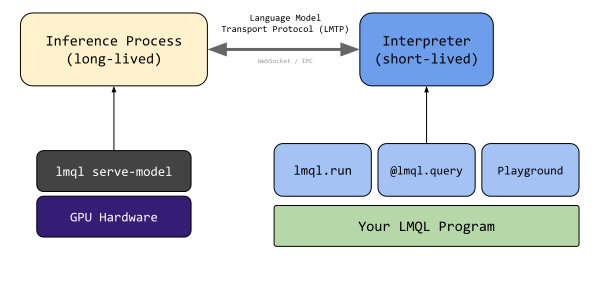

# The Language Model Transport Protocol

The Language Model Transport Protocol (LMTP) is a lightweight transport-agnostic protocol for streaming language model output between peers, processes, backends and frontend applications. 

It relieso on the idea of separating model loading and inference into a separate process (long-lived), which is then communicated with via a simple protocol. This allows for the model to be loaded once and then used by multiple clients, which each can be short-lived, startup and shutdown quickly, and be written in any language.



## Communication Channels

LMTP relies on two asynchronous communication channels:

* **Inference Process -> Client** This channel is used to send (multiple streams) of currently generated tokens to the client. Tokens from different streams are interleaved, but the order of tokens within a stream is preserved.

* **Client -> Inference Process** This channel is used to send new generation requests to the inference process. New generation requests can be sent at any time, and the inference process will respond with a stream of tokens as soon it schedules the request.

## Format

LMTP is based on a simple message-based two-way protocol. Each message is a single line of text of the following format:

```
<MESSAGE_TYPE> <JSON DATA>
```

The following `MESSAGE_TYPE` values are supported:

* `GENERATE` This message is used to begin a new generation stream of tokens.

    ```json
    GENERATE {"temperature": 1.2, "max_tokens": 64, "logit_bias": {"1": 100}, "model": "gpt2-medium", "prompt": [15496, 220], "stream_id": 2}
    ```
    
    As JSON data, a client provides decoder arguments such as `temperature` and `max_tokens`, but also logit masks and the prompt (of tokenized input IDs). Most importantly, each `GENERATE` request has a (session) unique stream ID that allows to distinguish between different streams of tokens, once they are received. 


* `TOKEN` This message type is used by the inference process to send a token to the client. The JSON data is of the following format:

    ```json
    TOKEN [
        {
            'token': 1256, 
            'stream_id': 1, 
            'logprob': -99.37353515625, 
            'finish_reason': None, 
            'top_logprobs': {
                '1256': -99.37353515625
            }
        },
        ...
    ]
    ```

    > JSON is formatted for readability, but is sent as a single line of text.

    The `TOKEN` message contains a list of tokens (for message efficiency) with fields as shown above. Each sent token is associated with a `stream_id` as previously set by the client's `GENERATE` request.

## Testing the Implementation

To test this implementation, first install the `main` branch of the `lmql` package and then run the following commands:

**Start the inference process:**

```bash
lmql serve-model gpt2-medium --cuda
```

> Note: If you specify no model or set it to `auto`, models will be loaded on-demand depending on the requested model name.

**Start the interactive client:**

```bash
python src/lmql/models/lmtp/lmtp_client.py  gpt2-medium
```

In the interactive client, you can now enter a prompt and see the generated tokens as they are received from the inference process. To specify custom parameters just add them to the end of the prompt, e.g.:

```bash
>>>> Hello there temperature=1.2
```

## Example Trace

```
Server:
> lmql serve-model --cuda gpt2-medium
[Loading gpt2-medium with AutoModelForCausalLM.from_pretrained(gpt2-medium, 'device_map': 'auto')]
======== Running on http://localhost:8080 ========
(Press CTRL+C to quit)
[gpt2-medium ready on device cuda:0]
GENERATE {"model": "gpt2-medium", "prompt": [15496, 612, 220], "stream_id": 1}
```

Client:
>>>> Hello there max_tokens=5
>>>> {'token': 10185, 'stream_id': 2, 'logprob': -42.2973747253418, 'finish_reason': None, 'top_logprobs': {'10185': -42.2973747253418}}
>>>> {'token': 198, 'stream_id': 2, 'logprob': -49.23591613769531, 'finish_reason': None, 'top_logprobs': {'198': -49.23591613769531}}
>>>> {'token': 198, 'stream_id': 2, 'logprob': 21.557533264160156, 'finish_reason': None, 'top_logprobs': {'198': 21.557533264160156}}
>>>> {'token': 40, 'stream_id': 2, 'logprob': -91.37769317626953, 'finish_reason': None, 'top_logprobs': {'40': -91.37769317626953}}
>>>> {'token': 1101, 'stream_id': 2, 'logprob': -131.75880432128906, 'finish_reason': 'length', 'top_logprobs': {'1101': -131.75880432128906}}
Hello there !!!

I'm
>>>>
```

## Future Work

* *Text Mode*: Currently LMTP assumes that client's send and receive tokens as token IDs. This makes sense in the setting of LMQL and allows token-wise streaming, even in the presence of multibyte characters. However, for simplified use, a text mode would be useful, where the server already sends detokenized text to the client. 

* *Buffers*: With multi-part prompts, instead of sending the same prompt with each request, token buffers could allow stateful re-use of data already send with previous requests, and/or generated by the resulting token streams. 

